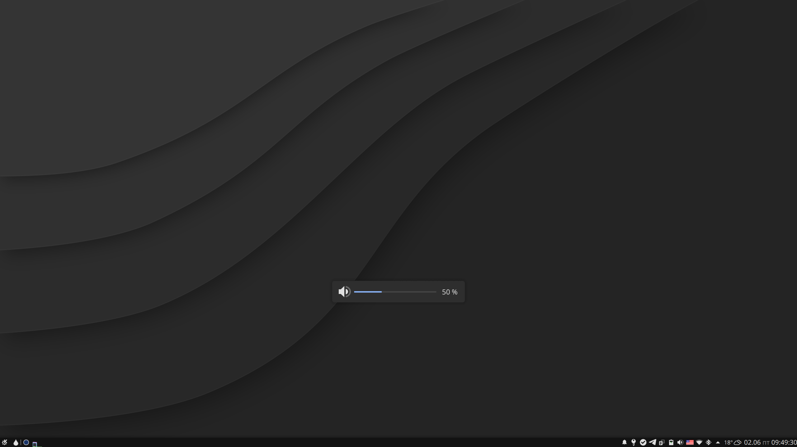
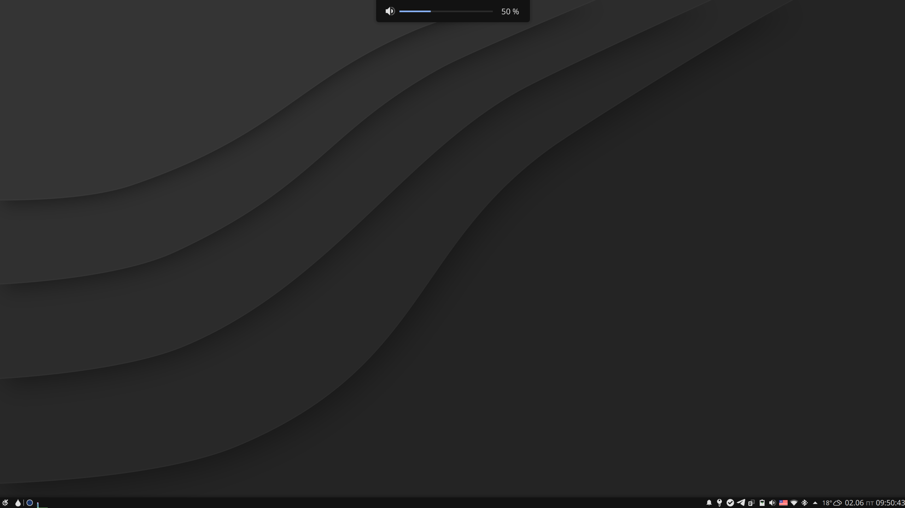

# breeze-osd-top

A modification of KDE Breeze theme that:
* moves OSD (volume/brightness/etc indicator)
to the top of the screen;
* changes the type of OSD window to `tooltip` which makes it to appear and hide with a nice sliding effect;
* makes OSD window slightly more compact.

Run `./install.sh install` to back up original files and install. 
`./install.sh install bottom` will make OSD to appear at the bottom of the screen instead of the top.

Run `.install.sh restore` to restore the backup.

Run `.install.sh forget` to delete the backup.

Original look and position:

Modified look and position:

